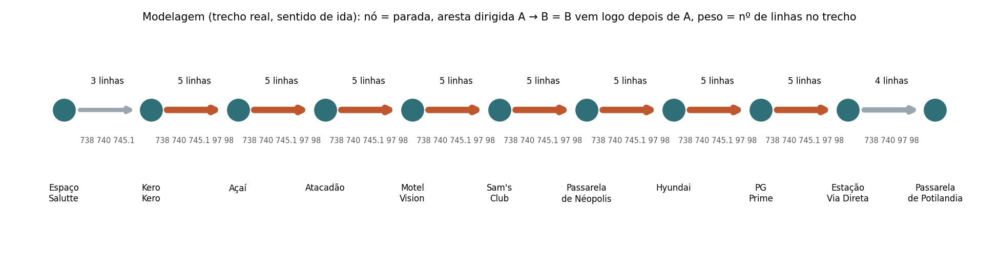
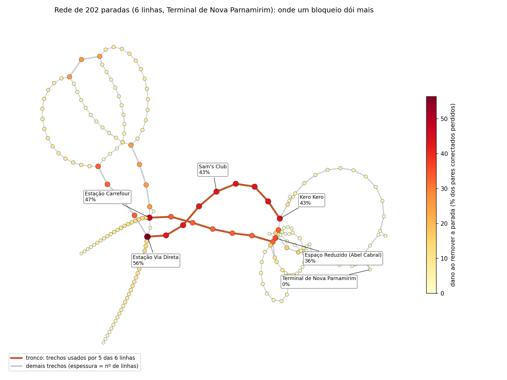
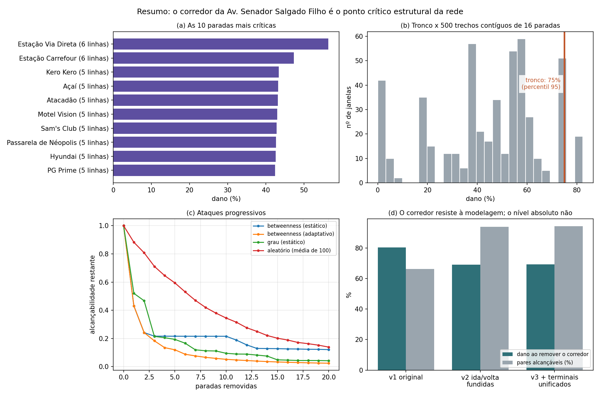

# Pontos críticos da rede de ônibus de Nova Parnamirim–Natal

> **Antes de entregar:** preencha os dois campos marcados com `PREENCHER` (integrantes e vídeo). Sem os nomes completos e sem o link do vídeo, a nota do projeto é zero ou não é computada.

> **Organização:** este `README.md` fica na raiz do repositório e todo o projeto está na pasta [`projeto_onibus_natal/`](projeto_onibus_natal/). Os caminhos escritos em código neste texto (`src/`, `data/`, `figs/`, `pdfs/`) são relativos a essa pasta.

## Integrantes

PREENCHER: Nome Completo 1 · Nome Completo 2 · Nome Completo 3

## Vídeo

PREENCHER: https://youtu.be/... (até 15 min no total; não listado, nunca privado)

## Problema e pergunta

Quais paradas e trechos da rede das seis linhas que partem do Terminal de Nova Parnamirim, se bloqueados (por exemplo, por alagamento), mais prejudicam a operação, e o corredor da Av. Senador Salgado Filho é de fato o ponto crítico? Detalhes e definição de "dano" em [ANALISE_semana_05_10.md](projeto_onibus_natal/ANALISE_semana_05_10.md) (parte 0).

## Dados

- **Fonte:** PDFs "Linhas e Itinerários" da Viação Cidade das Dunas, linhas 97, 98, 738, 740, 745.1 e 745.2, na pasta `pdfs/`.
- **Como obter:** os PDFs já estão no repositório; `src/01_extrair.py` lê as tabelas e grava `data/paradas_raw.csv` (448 registros).
- **Limpeza:** padronização de nomes, identificação de paradas por nome + endereço, equivalências manuais de endereço, auditoria em `data/auditoria_nomes.csv`. Detalhes em [MODELAGEM.md](projeto_onibus_natal/MODELAGEM.md).

## Modelagem

- **Nó:** uma parada, identificada por nome limpo + endereço normalizado (202 nós).
- **Aresta A → B:** B vem logo depois de A no itinerário de pelo menos uma linha (227 arestas).
- **Direção:** sim; ida e volta são nós distintos quando o endereço muda.
- **Peso:** número de linhas que fazem o trecho (1 a 5).
- **Fica de fora:** horários, frequência, demanda, tempo e distância reais, outras empresas e linhas de Natal, deslocamento a pé entre paradas.
- **Alternativas testadas:** v2 (ida e volta fundidas por nome e via) e v3 (v2 com os terminais unificados), além da rede bipartida linha × parada com projeção e Jaccard.



Decisões de limpeza, problemas conhecidos dos dados e a tabela completa em [MODELAGEM.md](projeto_onibus_natal/MODELAGEM.md).

## Conteúdo do curso utilizado

| conceito | semana | onde aparece | para que serviu |
|---|---|---|---|
| matriz de adjacência, densidade | 2 | `src/04_parte1_descricao.py` | descrever a rede (esparsa, 0,56%) |
| grau de entrada e saída, distribuição de grau | 2, 3 | `src/04_parte1_descricao.py` | mostrar que a rede é feita de cadeias e achar entroncamentos |
| sub-redes por linha | 2 | `src/04_parte1_descricao.py` | medir o compartilhamento entre linhas |
| componentes WCC e SCC | 4 | `src/05_parte2_conectividade.py` | separar ida e volta, medir fragmentação |
| caminhos mínimos, diâmetro, eficiência | 4 | `src/05_parte2_conectividade.py`, `src/metricas.py` | alcançabilidade e base do dano |
| triângulos e clustering | 4 | `src/05_parte2_conectividade.py` | mostrar que não há estrutura local densa |
| closeness, betweenness, eigenvector | 4 | `src/06_parte3_centralidades.py` | achar o corredor crítico e comparar hubs e pontes |
| remoção de nós e arestas, robustez e ataques à rede | 3, 4 | `src/07_parte4_remocao.py`, `src/metricas.py` | medir o dano de cada parada, trecho e grupo (alagamento) |
| k-core, k-shell, core number, degeneracy, onion layers, k-truss | 5 | `src/08_parte5_nucleos.py` | testar se o núcleo coincide com o corredor crítico |
| redes bipartidas, matriz de incidência, projeção, Jaccard | 6 | `src/09_parte6_alternativas.py` | comparar linhas e achar o corredor sem usar a ordem das paradas |
| modelagens alternativas (ida/volta fundidas, terminais unificados) | 2, 6 | `src/variantes.py`, `src/09_parte6_alternativas.py` | testar se as conclusões dependem da modelagem |

## Como executar

Requer **Python 3.12** (versão usada nos testes). Primeiro, abra um terminal na raiz do repositório e **entre na pasta do projeto**:

```bash
cd projeto_onibus_natal
```

Todos os comandos abaixo são executados nessa pasta (a que contém `reproduzir.py`, `run_all.sh` e `requirements.txt`). A execução leva cerca de 1 min 30 s a 2 min e passa por 10 etapas, de `[1/10]` a `[10/10]`.

### Linux e Mac: um comando

```bash
./run_all.sh
```

O script cria o ambiente virtual (`.venv`), instala as dependências fixadas de `requirements.txt` e roda todo o projeto. Se aparecer "permissão negada", use `bash run_all.sh`.

### Windows: passo a passo (PowerShell ou Prompt de Comando)

O `run_all.sh` é um script de bash e **foi escrito e testado em Linux** (Python 3.12.3). Ele pode funcionar no Git Bash ou no WSL, mas isso não foi testado. No Windows, use os comandos abaixo, que fazem o mesmo:

```bash
python -m venv .venv
.venv\Scripts\activate
pip install -r requirements.txt
python reproduzir.py
```

Se o PowerShell bloquear o `activate`, rode antes `Set-ExecutionPolicy -Scope Process Bypass`.

### Qualquer sistema, com as dependências já instaladas

```bash
pip install -r requirements.txt
python reproduzir.py
```

### Saídas

Tabelas em `data/` e `data/analise/`, **todas as figuras em `figs/` (geradas pelo código)**, grafos `rede_v1.graphml`, `rede_v1_nucleos.graphml`, `rede_v2.graphml` e `rede_v3.graphml` (abrem no Gephi) e o log completo em `data/analise/log_execucao.txt`. Os sorteios usam semente fixa (42), então duas execuções geram tabelas idênticas.

## Estrutura do repositório

```
README.md                       este arquivo (raiz do repositório)
LICENSE
projeto_onibus_natal/
  pdfs/                         itinerários originais (fonte dos dados)
  src/                          01_extrair ... 10_parte7_figuras, metricas.py, variantes.py
  data/                         dados extraídos e limpos (paradas, arestas, itinerários, incidência)
  data/analise/                 tabelas de cada parte da análise e o log de execução
  figs/                         figuras geradas pelo código
  reproduzir.py                 orquestrador (roda todas as etapas em ordem)
  run_all.sh                    ambiente virtual + dependências + reproduzir.py (Linux e Mac)
  requirements.txt              dependências com versões fixadas
  MODELAGEM.md                  decisões de modelagem e limpeza
  ANALISE_semana_05_10.md       resultados, interpretação e limitações (partes 0 a 8)
  rede_v1.graphml ...           grafos (abrem no Gephi)
```

## Resultados

**Dano** de remover um conjunto de paradas = fração dos pares de paradas antes conectados (por caminho dirigido) que deixam de ser.



- O **corredor da Av. Senador Salgado Filho** (Kero Kero → Estação Via Direta na ida; Estação Carrefour → Atacadão na volta) é usado por 5 das 6 linhas. Removê-lo (16 paradas) elimina **75%** dos pares conectados e divide a rede em 5 componentes. Isso supera cerca de 95% dos trechos contíguos de mesmo tamanho e se mantém ao variar o limiar que define o tronco (dano de 90%, 80% e 75% com 3, 4 ou 5 linhas por trecho).
- As paradas mais críticas são a **Estação Via Direta (56%)** e a **Estação Carrefour (47%)**, seguidas pelas do corredor (42% a 43%, quase iguais porque são consecutivas).
- A **ida** do corredor pesa mais que a volta (56,8% contra 46,2%).
- **Grau não prevê criticidade** (Spearman 0,17 com o dano); a **betweenness prevê** (0,75).
- A decomposição em **núcleos** (degeneracy 2) não identifica o corredor: ele é crítico pela posição, não pela densidade.
- **Robustez:** o corredor continua sendo o ponto crítico nas três modelagens (dano de 69% a 80%), mas o nível absoluto de alcançabilidade (66% contra 94%) e o ranking de paradas individuais dependem da modelagem.



Todos os números, tabelas e a interpretação completa em [ANALISE_semana_05_10.md](projeto_onibus_natal/ANALISE_semana_05_10.md).

## Limitações e próximos passos

- **Só topologia:** sem demanda, tempo ou distância, "crítico" significa estrutural.
- **Recorte:** seis linhas de uma empresa a partir de um terminal; sem as outras linhas e vias de Natal o corredor parece mais insubstituível do que seria na cidade real.
- **Modelagem:** ida/volta e terminais mudam o nível absoluto e o ranking individual.
- **"Bloqueio"** supõe que o ônibus não passa pelo ponto, sem desvio nem baldeação a pé.
- **Dados dos PDFs** com erros de cadastro e limpeza baseada em regras; sem coordenadas.
- **Sem validação externa** com alagamentos reais.
- **Próximos passos:** geocodificar e usar distâncias reais; obter demanda; incluir as demais linhas de Natal; confrontar com pontos de alagamento conhecidos; modelar horários e baldeação.

## Referências

**Dados**

VIAÇÃO CIDADE DAS DUNAS. *Linhas e Itinerários*: linhas 97, 98, 738, 740, 745.1 e 745.2. Tabelas de paradas em PDF (cópias em `pdfs/`).

**Disciplina**

SILVA, Ivanovitch. *Prova e projeto: como a unidade será avaliada*. Algoritmos e Estrutura de Dados II (Grafos). Natal: Universidade Federal do Rio Grande do Norte, 16 set. 2026. Material de aula.

**Métodos**

ALBERT, Réka; JEONG, Hawoong; BARABÁSI, Albert-László. Error and attack tolerance of complex networks. *Nature*, v. 406, n. 6794, p. 378–382, 2000. DOI: 10.1038/35019019.

BRANDES, Ulrik. A faster algorithm for betweenness centrality. *Journal of Mathematical Sociology*, v. 25, n. 2, p. 163–177, 2001. DOI: 10.1080/0022250X.2001.9990249.

LATORA, Vito; MARCHIORI, Massimo. Efficient behavior of small-world networks. *Physical Review Letters*, v. 87, n. 19, art. 198701, 2001. DOI: 10.1103/PhysRevLett.87.198701.

SEIDMAN, Stephen B. Network structure and minimum degree. *Social Networks*, v. 5, n. 3, p. 269–287, 1983.

**Software** (versões em `requirements.txt`): Python, NetworkX, pandas, NumPy, SciPy, Matplotlib, pdfplumber.
